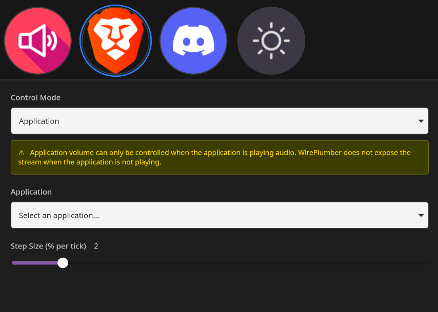

# Volume Dials

A Linux-compatible Stream Deck plugin for controlling system and application volume using WirePlumber.



## Features

- **Volume Control**: Adjust volume by rotating the dial
- **Mute Toggle**: Press the dial to toggle mute
- **System & Application Control**: Control system-wide volume or target specific applications
- **Application Selection**: Easy-to-use dropdown with application icons from your desktop environment
- **Visual Feedback**: Application icons are displayed on the dial when an application is selected

## Requirements

- **Linux** (tested on Arch Linux / CachyOS)
- **WirePlumber** (PipeWire session manager)
- **OpenDeck** or compatible Stream Deck software
  - Works with [OpenDeck](https://github.com/nekename/OpenDeck) - an open-source alternative to Elgato's Stream Deck software
- **Stream Deck hardware** (Elgato Stream Deck or compatible device)

## Installation

1. Download the latest release from the [Releases](https://github.com/jeremyfry/linux-streamdeck-volume-knobs/releases) page
2. Select Install from File in Open Deck


## Usage

### Adding a Volume Dial

1. Drag the "Volume Dial" action to your Stream Deck
2. Click on the action to open the Property Inspector
3. Configure your settings:
   - **Control Mode**: Choose "System" for system-wide volume or "Application" for per-app control
   - **Application** (Application mode only): Select the application you want to control from the dropdown
   - **Step Size**: Set how much the volume changes per dial tick (1-10%, default: 2%)

### Using the Dial

- **Rotate**: Adjust volume up or down
- **Press**: Toggle mute on/off

### Application Mode

When using Application mode:
- The application must be **actively playing audio** for volume control to work
- WirePlumber does not expose audio streams when applications are not playing audio
- If an application is not found or not playing audio, you'll see an error message

## Technical Details

This plugin uses:
- **WirePlumber** (`wpctl`) for audio control
- **PipeWire** for audio management
- **Desktop Entry files** (`/usr/share/applications`) for application discovery
- **Process ID (PID) matching** to identify active audio streams

### How It Works

1. **System Mode**: Uses `@DEFAULT_AUDIO_SINK@` to control the default audio output
2. **Application Mode**: 
   - Uses `pidof` to find the application's process ID
   - Matches the PID with active audio clients in WirePlumber
   - Controls volume using PID-based commands

## Compatibility

- **Tested on**: Arch Linux (CachyOS)
- **Works with**: [OpenDeck](https://github.com/nekename/OpenDeck)
- **Audio System**: WirePlumber / PipeWire
- **Should work on**: Any Linux distribution with WirePlumber and PipeWire installed

## Development

### Building from Source

```bash
npm install
npm run build
```

### Packaging

```bash
npm run package
```

This creates a `.zip` file ready for distribution.

### Debug Logging

Set `VOLUME_DIALS_DEBUG=true` before running the plugin.